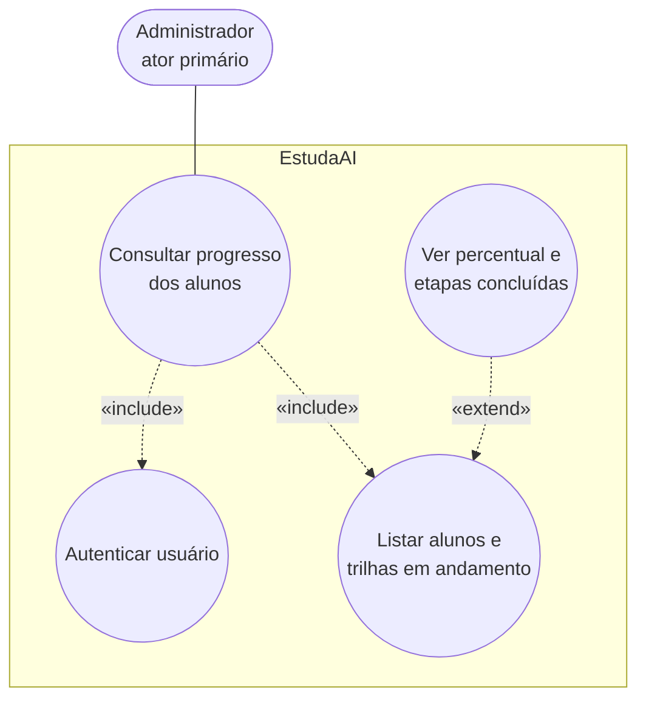

# UC04 — Consultar progresso dos alunos

**Sistema:** EstudaAI  
**Caso de uso:** Consultar progresso dos alunos  
**Ator primário:** Administrador  

Fundamentação: [RF15](EstudaAI_RF.md), [RF06](EstudaAI_RF.md), [RB04, RB06, RB14, RB18](EstudaAI_RB.md), persona [Mariana Costa](persona2.md).

Este caso de uso **não** é o UC01. O administrador não escolhe trilha, não marca conclusão e não conversa com o agente.

## 1. Diagrama (Mermaid)

## 2. Caso de uso textual

| Campo | Conteúdo |
|---|---|
| Identificador | UC04 |
| Nome | Consultar progresso dos alunos |
| Ator primário | Administrador |
| Nível | Objetivo do usuário |
| Entidades | `Aluno`, `Progresso`, `Trilha`, `Etapa`, `ConclusaoEtapa` |

### Objetivo

Permitir que o administrador veja quais trilhas cada aluno acompanha e o percentual derivado, sem alterar o acompanhamento.

### Pré-condições

1. O ator está autenticado com perfil administrador.
2. Podem existir zero ou mais alunos com `Progresso`.

### Pós-condições de sucesso

1. O administrador visualizou a lista e, se pediu detalhe, as etapas concluídas e pendentes.
2. Nenhum `Progresso` nem `ConclusaoEtapa` foi criado, alterado ou removido (RB18).

### Fluxo principal

1. O administrador autentica-se.
2. O sistema lista os alunos e, para cada um, as trilhas em acompanhamento com percentual.
3. O administrador seleciona um aluno e vê o detalhe (título da trilha, tipo, etapas concluídas / total, próxima etapa).
4. O caso de uso encerra.

### Fluxos alternativos

**A1 — Aluno sem progresso**  
A lista mostra o aluno sem trilhas em andamento. Nada é criado.

**A2 — Só a lista**  
O administrador consulta o resumo e não abre o detalhe.

### Fluxos de exceção

**E1 — Aluno ou anônimo**  
Recusa (RNF06).

**E2 — Pedido de conclusão, escolha de trilha ou conversa pelo administrador**  
Recusa: permanece o UC01 exclusivo do aluno (RB14).
