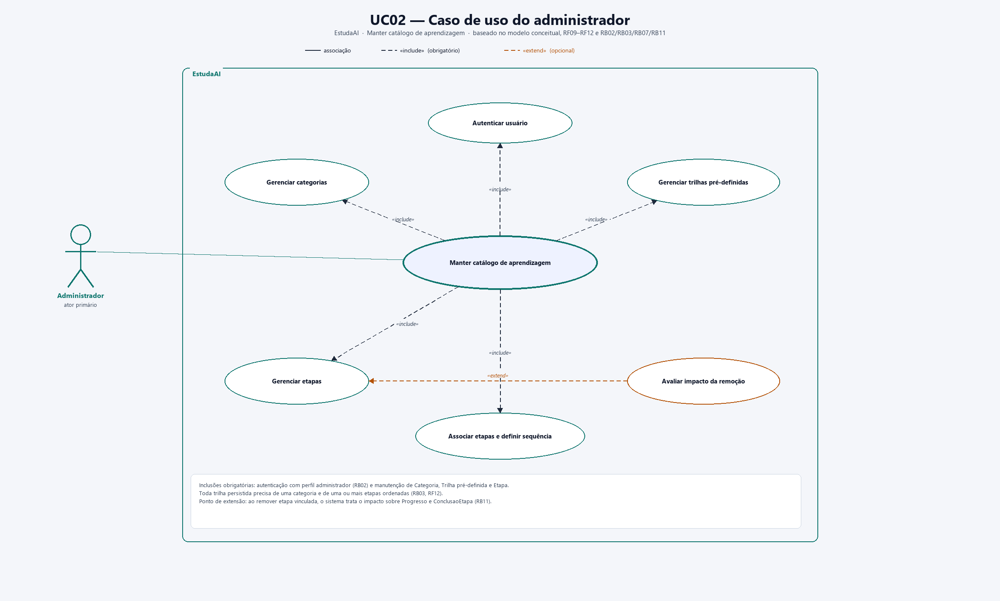
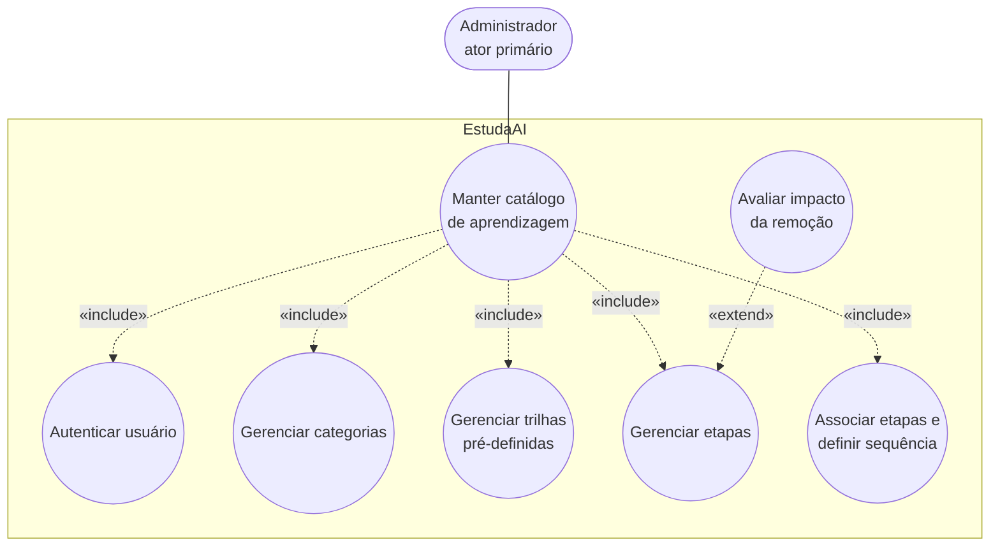

# UC02 — Caso de uso do administrador

**Sistema:** EstudaAI  
**Caso de uso:** Manter catálogo de aprendizagem  
**Ator primário:** Administrador  

O diagrama em PNG está em [`caso-uso-admin.png`](caso-uso-admin.png). Fundamentação: [modelo conceitual](modelo-conceitual.md), [RF09–RF13](EstudaAI_RF.md), [RB02, RB03, RB07, RB11, RB13 e RB14](EstudaAI_RB.md) e persona [Mariana Costa](persona2.md).

## 1. Diagrama (Mermaid)

## 2. Relacionamentos do diagrama

| Relação | Tipo | Significado |
|---|---|---|
| Manter catálogo → Autenticar usuário | «include» | RF02 e RB02: só o perfil administrador altera o catálogo |
| Manter catálogo → Gerenciar categorias | «include» | RF09; toda `Trilha` precisa de uma `Categoria` (RB03) |
| Manter catálogo → Gerenciar trilhas pré-definidas | «include» | RF10, RB07 |
| Manter catálogo → Gerenciar etapas | «include» | RF11 |
| Manter catálogo → Associar etapas e definir sequência | «include» | RF12; a trilha deve ter uma ou mais etapas ordenadas (RB03) |
| Avaliar impacto da remoção → Gerenciar etapas | «extend» | RB11: se a etapa está em uso, a remoção é recusada; `ConclusaoEtapa` permanece |

Não há ator secundário. A gestão do catálogo é restrição de permissão do `Administrador`, não uma associação estrutural persistida no modelo conceitual.

## 3. Caso de uso textual

### Identificação

| Campo | Conteúdo |
|---|---|
| Identificador | UC02 |
| Nome | Manter catálogo de aprendizagem |
| Ator primário | Administrador |
| Atores secundários | — |
| Nível | Objetivo do usuário |
| Tipo | Concreto |
| Entidades do modelo conceitual | `Usuario`/`Administrador`, `Categoria`, `Trilha` (tipo `pré-definida`), `Etapa`, e, na remoção, `Progresso` e `ConclusaoEtapa` |

### Objetivo

Permitir que o administrador cadastre, consulte, altere e remova categorias, trilhas pré-definidas e etapas, associando etapas à trilha em uma sequência definida, sem comprometer o progresso dos alunos.

### Pré-condições

1. Existe uma conta de `Usuario` com perfil de administrador, criada por **seed/script na implantação**. Não há promoção de aluno nem cadastro administrativo distinto nesta versão.
2. Existe (ou será criada) a categoria sentinela **Personalizada**, exigida por trilhas geradas via LLM.
3. O administrador pretende publicar ou revisar conteúdo curado do catálogo (RB07) ou o interruptor do LLM (RF13).

### Pós-condições de sucesso

1. O administrador está autenticado com perfil autorizado (RB02).
2. Cada `Trilha` pré-definida persistida possui exatamente uma `Categoria` e uma ou mais `Etapa` com `ordem` definida (RB03, RF12).
3. O catálogo fica disponível para escolha pelos alunos (RF03).
4. Se houve pedido de remoção de etapa ou categoria em uso, a operação foi recusada e o catálogo permanece íntegro (RB11, RB13).

### Pós-condição de falha

O catálogo permanece no estado anterior. Operações de criação, alteração ou remoção pedidas por quem não é administrador são recusadas (RB02).

### Fluxo principal

Caminho feliz: cadastrar uma trilha pré-definida completa e publicá-la no catálogo.

1. O administrador informa e-mail e senha.
2. O sistema autentica o `Usuario` com JWT, confirma o perfil administrador (RF02, RB02, RB14, RNF06) e **não** abre o UC01.
3. O administrador cadastra uma `Categoria` ou seleciona uma já existente (RF09).
4. O administrador cadastra uma `Trilha` do tipo `pré-definida`, associada a essa categoria (RF10, RB07).
5. O administrador cadastra as `Etapa` com titulo, conteúdo e ordem pretendida (RF11).
6. O administrador associa as etapas à trilha e confirma a sequência (RF12).
7. O sistema valida se a trilha possui categoria e ao menos uma etapa ordenada (RB03).
8. O sistema disponibiliza a trilha no catálogo para os alunos.
9. O caso de uso encerra.

### Fluxos alternativos

**A1 — Credenciais inválidas ou perfil insuficiente**  
No passo 2, se a autenticação falhar ou o perfil não for administrador, o sistema recusa o acesso ao catálogo (RB02) e encerra o fluxo de manutenção.

**A2 — Consultar o catálogo (RF09–RF11)**  
Após o passo 2, o administrador apenas consulta categorias, trilhas e etapas, sem alterar dados, e encerra.

**A3 — Alterar categoria, trilha ou etapa**  
Após o passo 2, o administrador seleciona um item existente, altera nome, descrição, titulo, conteúdo ou ordem, e o sistema persiste a mudança desde que RB03 continue atendida.

**A4 — Remover categoria, trilha ou etapa sem vínculo**  
O administrador solicita a remoção.

- **Etapa:** só conclui se a trilha **não** tiver progresso de alunos **e** restar 1..* etapas (RB11, RB03). `ConclusaoEtapa` já registradas são preservadas.
- **Categoria:** só conclui se **nenhuma** trilha (inclusive personalizadas na sentinela **Personalizada**) estiver classificada nela (RB13). Sem cascata e sem recategorização.
- **Trilha pré-definida sem progresso:** o sistema conclui a remoção e atualiza o catálogo.

**A5 — Avaliar impacto da remoção (ponto de extensão, RB11)**  
No pedido de remoção de uma `Etapa` já vinculada a uma `Trilha` com `Progresso` vigente:

1. O sistema identifica os `Progresso` e `ConclusaoEtapa` afetados.
2. O sistema **recusa** a remoção e informa o impacto ao administrador.
3. Nada é removido; o percentual dos acompanhamentos vigentes não muda.

**A6 — Reordenar etapas de uma trilha já publicada (RF12)**  
O administrador altera a `ordem` das etapas associadas. O sistema grava a nova sequência. Conclusões já registradas dos alunos permanecem ligadas às etapas correspondentes.

**A7 — Interruptor do LLM (RF13, RNF02)**  
Após o passo 2, o administrador habilita ou desabilita a função de modelo de linguagem. Com a função desligada, o UC01 segue só pelo catálogo; se o catálogo também estiver vazio, aplica-se UC01-E4.

### Fluxos de exceção

**E1 — Operação administrativa por aluno (RB02, RNF06)**  
Se um usuário sem perfil administrador solicitar criação, alteração ou remoção de categoria, trilha pré-definida ou etapa, o sistema recusa a operação.

**E2 — Trilha incompleta (RB03)**  
No passo 7, se faltar categoria ou não houver etapas associadas, o sistema não publica a trilha e solicita a correção.

**E3 — Remoção recusada por vínculo (RB11, RB13)**  
Em A4/A5, se houver progresso na etapa, se a trilha ficaria sem etapas, ou se a categoria ainda classificar trilhas, o sistema aborta a remoção e mantém etapas, categorias, progressos e conclusões inalterados.

### Regras de negócio e requisitos

| Item | Papel neste caso de uso |
|---|---|
| RF02, RNF05, RNF06 | Autenticação JWT e restrição ao perfil administrador |
| RF09, RB13 | CRUD de `Categoria`; bloqueio se ainda classificar trilhas |
| RF10, RB07 | CRUD de `Trilha` pré-definida curada |
| RF11, RB11 | CRUD de `Etapa`; bloqueio se houver progresso vigente |
| RF12, RB03 | Associação e sequência; trilha com categoria e 1..* etapas |
| RF13, RNF02 | Interruptor do Gemini |
| RB02, RB14 | Somente administrador cria, altera ou remove o catálogo; XOR de perfil |
| RB10 | Catálogo curado permanece distinto das sugestões do LLM |
