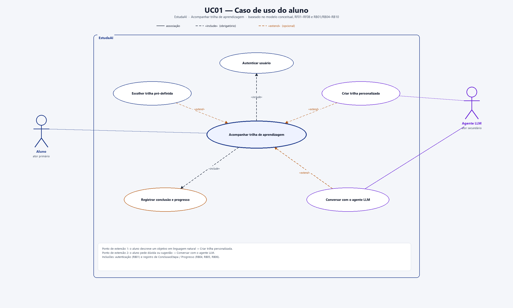
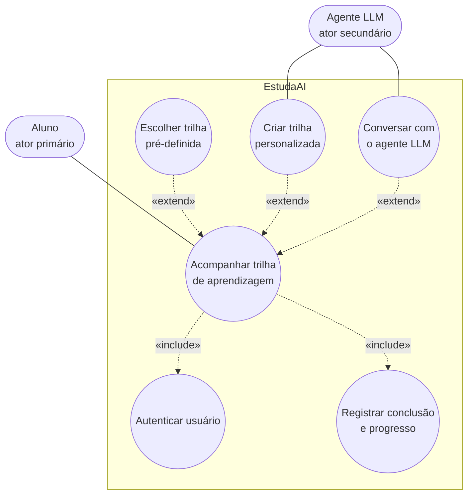

# UC01 — Caso de uso do aluno

**Sistema:** EstudaAI  
**Caso de uso:** Acompanhar trilha de aprendizagem  
**Ator primário:** Aluno  
**Ator secundário:** Agente LLM  

O diagrama em PNG está em [`caso-uso-aluno.png`](caso-uso-aluno.png). Fundamentação: [modelo conceitual](modelo-conceitual.md), [RF01–RF08](EstudaAI_RF.md), [RB01, RB03–RB10 e RB14](EstudaAI_RB.md) e persona [Lucas Almeida](persona1.md).

## 1. Diagrama (Mermaid)

## 2. Relacionamentos do diagrama

| Relação | Tipo | Significado |
|---|---|---|
| Acompanhar trilha → Autenticar usuário | «include» | RB01 exige autenticação para selecionar trilha, criar trilha personalizada ou registrar progresso. Listar o catálogo pode ser anônimo. |
| Acompanhar trilha → Registrar conclusão e progresso | «include» | O acompanhamento sempre consulta `Progresso` e pode registrar `ConclusaoEtapa` |
| Escolher trilha pré-definida → Acompanhar trilha | «extend» | Caminho opcional: o aluno escolhe uma `Trilha` curada do catálogo |
| Criar trilha personalizada → Acompanhar trilha | «extend» | Caminho opcional: `SolicitacaoTrilha` origina `Trilha` personalizada com apoio do Agente LLM |
| Conversar com o agente LLM → Acompanhar trilha | «extend» | Apoio opcional; as `Mensagem` não substituem a curadoria (RB10) |

## 3. Caso de uso textual

### Identificação

| Campo | Conteúdo |
|---|---|
| Identificador | UC01 |
| Nome | Acompanhar trilha de aprendizagem |
| Ator primário | Aluno |
| Atores secundários | Agente LLM |
| Nível | Objetivo do usuário |
| Tipo | Concreto |
| Entidades do modelo conceitual | `Usuario`/`Aluno`, `Categoria`, `Trilha`, `Etapa`, `Progresso`, `ConclusaoEtapa`, `SolicitacaoTrilha`, `Mensagem` |

### Objetivo

Permitir que o aluno inicie ou retome uma trilha, visualize etapas e sequência, registre conclusões explícitas e acompanhe o percentual de progresso, com opção de trilha personalizada e de conversa com o agente LLM.

### Pré-condições

1. Para cadastro: o e-mail ainda não está em uso (RF01). O primeiro administrador **não** nasce neste fluxo: é criado por seed na implantação.
2. Para escolher trilha, criar personalizada, registrar progresso ou conversar: o ator é `Aluno` autenticado (RB01, RB14). Administrador **não** executa o UC01.
3. Existem trilhas pré-definidas no catálogo **ou** o serviço de LLM está habilitado pelo administrador. Se nenhum dos dois valer, o sistema apenas informa catálogo indisponível (E4).

### Pós-condições de sucesso

1. O aluno está autenticado.
2. Existe um `Progresso` individual do aluno associado a uma `Trilha` (pré-definida ou personalizada).
3. A trilha visível possui categoria e uma ou mais etapas ordenadas (RB03).
4. O `/percentualProgresso` reflete apenas etapas com `ConclusaoEtapa` (RB05, RB06).
5. Se o caminho personalizado foi usado, existem `SolicitacaoTrilha` e `Trilha` do tipo `personalizada` associadas ao aluno (RB08, RB09).

### Pós-condição de falha

Nenhuma trilha é associada ao aluno e nenhum `Progresso` novo é persistido. Tentativas sem autenticação são recusadas (RB01).

### Fluxo principal

Caminho feliz: o aluno autenticado escolhe uma trilha pré-definida e registra progresso.

1. O aluno informa e-mail e senha.
2. O sistema autentica o `Usuario` com JWT (Bearer), confirma o perfil aluno e libera as funções (RF02, RB14).
3. O sistema exibe o catálogo de trilhas pré-definidas organizadas por `Categoria` (RF03). A mesma listagem também é visível sem login.
4. O aluno escolhe uma trilha pré-definida.
5. O sistema cria ou retoma o `Progresso` individual desse aluno nessa `Trilha` (RB04).
6. O sistema exibe titulo, descrição, etapas, conteúdos e sequência (RF05).
7. O sistema exibe o `/percentualProgresso` (RF06, RB06).
8. O aluno solicita a conclusão de uma etapa que estudou (RF07).
9. O sistema registra `ConclusaoEtapa` com `dataConclusao` somente mediante essa marcação explícita (RB05).
10. O sistema recalcula o percentual e mantém o histórico enquanto `Progresso.ativo` for verdadeiro (RB12).
11. O caso de uso encerra com o aluno ciente da próxima etapa.

### Fluxos alternativos

**A1 — Cadastro na primeira utilização (RF01)**  
No passo 1, se o aluno ainda não possui conta, o sistema permite o cadastro e retorna ao passo 1.

**A2 — Credenciais inválidas**  
No passo 2, o sistema informa a falha e volta ao passo 1. O catálogo e o progresso permanecem inacessíveis.

**A3 — Criar trilha personalizada (ponto de extensão, RF04, RB08, RB09)**  
No passo 3, o aluno descreve o objetivo de estudo em linguagem natural em vez de escolher o catálogo. A geração é **síncrona** (sem fila), com timeout de 60 segundos.

1. O sistema registra `SolicitacaoTrilha.textoObjetivo` e encaminha o texto ao Agente LLM (Gemini, se habilitado).
2. O Agente LLM devolve `respostaLLM` em JSON com `titulo`, `descricao` e etapas `{titulo, conteudo, ordem}`.
3. O sistema cria `Trilha` do tipo `personalizada`, classificada na categoria sentinela **Personalizada**, com uma ou mais `Etapa` ordenadas cujo `conteudo` é Markdown (RB03).
4. O sistema associa a trilha ao aluno por meio de `Progresso` (RB09).
5. O fluxo continua no passo 6.

**A4 — Apenas consultar o progresso**  
No passo 7, o aluno encerra sem marcar nova etapa. O histórico já registrado é preservado (RB12).

**A5 — Conversar com o agente LLM (ponto de extensão, RF08, RB10)**  
Após o passo 6, o aluno com trilha em andamento envia uma `Mensagem` referida a essa `Trilha`. O Agente LLM responde com apoio ao estudo (timeout 60 s). Sem progresso ativo, o sistema recusa a conversa. A conversa **não** altera a curadoria das trilhas pré-definidas.

**A6 — Retomar trilha já acompanhada**  
No passo 4, se já existir `Progresso` ativo para a trilha escolhida, o sistema retoma etapas, conclusões e percentual existentes, sem criar outro acompanhamento. Não há fluxo de pausar, abandonar ou reiniciar.

**A7 — Logout**  
A qualquer momento após o passo 2, o aluno solicita encerramento de sessão (RF02). O sistema efetua o logout.

### Fluxos de exceção

**E1 — Uso sem autenticação (RB01)**  
Se o aluno tentar escolher trilha, criar trilha personalizada ou registrar progresso sem sessão autenticada, o sistema recusa a operação e conduz à autenticação. A **listagem** do catálogo permanece disponível.

**E2 — Agente LLM indisponível ou timeout**  
Em A3 ou A5, se o Agente LLM não produzir resposta em 60 segundos, o sistema não cria `Trilha` personalizada (A3), não altera o catálogo (A5), informa a falha e, em A3, oferece o catálogo pré-definido.

**E3 — Resposta do LLM insuficiente (RB03)**  
Em A3, se faltar `titulo`/`descricao` ou não houver 1..* etapas ordenadas, o sistema não persiste a trilha e solicita nova descrição ou cancelamento. A categoria **não** vem do LLM.

**E4 — Catálogo vazio e LLM desabilitado**  
Se não houver trilha pré-definida e o LLM estiver desligado, o sistema exibe mensagem de catálogo indisponível. Nenhuma `Trilha` personalizada é persistida.

### Regras de negócio e requisitos

| Item | Papel neste caso de uso |
|---|---|
| RF01, RF02 | Cadastro (e-mail único, senha com hash, recuperação), login JWT, logout |
| RF03, RF05 | Catálogo (listagem anônima), etapas, conteúdos Markdown e sequência |
| RF04, RB08, RB09 | Trilha personalizada síncrona; sentinela **Personalizada**; JSON de `respostaLLM` |
| RF06, RF07, RB04, RB05, RB06, RB12 | Progresso individual, conclusão explícita e percentual derivado |
| RF08, RB10 | Conversa de apoio com trilha obrigatória, sem substituir trilhas curadas |
| RB01 | Autenticação obrigatória para trilhas e progresso; listagem livre |
| RB03 | Trilha sempre com categoria e etapas ordenadas |
| RB14 | UC01 exclusivo do aluno |
