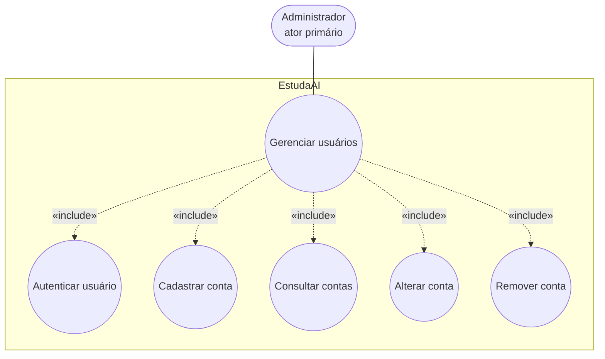

# UC03 — Gerenciar usuários

**Sistema:** EstudaAI  
**Caso de uso:** Gerenciar usuários  
**Ator primário:** Administrador  

Fundamentação: [RF14](EstudaAI_RF.md), [RB14–RB17](EstudaAI_RB.md), [RNF05, RNF06](EstudaAI_RNF.md), persona [Mariana Costa](persona2.md).

## 1. Diagrama (Mermaid)

## 2. Caso de uso textual

| Campo | Conteúdo |
|---|---|
| Identificador | UC03 |
| Nome | Gerenciar usuários |
| Ator primário | Administrador |
| Nível | Objetivo do usuário |
| Entidades | `Usuario`, `Aluno`, `Administrador`, e, na remoção, `Progresso` |

### Objetivo

Permitir que o administrador cadastre, consulte, altere e remova contas de aluno e de administrador, sem acumular os dois perfis na mesma conta e sem deixar o sistema sem administrador.

### Pré-condições

1. O ator está autenticado com perfil administrador (RF02, RB15).
2. Existe ao menos um administrador (seed da implantação ou conta já criada neste caso de uso).

### Pós-condições de sucesso

1. A conta persistida é **somente** aluno **ou** **somente** administrador (RB14).
2. Permanece ao menos um administrador (RB16).
3. Aluno com `Progresso` não foi removido; aluno com `Progresso` não teve o perfil alterado para administrador (RB17).

### Fluxo principal

1. O administrador autentica-se.
2. O sistema confirma o perfil administrador e libera a gestão de contas.
3. O administrador cadastra uma conta com nome, e-mail, senha e perfil (`aluno` ou `administrador`).
4. O sistema persiste a conta com senha em hash e e-mail único.
5. O caso de uso encerra.

### Fluxos alternativos

**A1 — Consultar contas**  
Após o passo 2, o administrador lista alunos e administradores (nome, e-mail, perfil) e encerra.

**A2 — Alterar conta**  
Após o passo 2, o administrador altera nome, e-mail, senha e/ou perfil, desde que RB14, RB16 e RB17 continuem atendidos.

**A3 — Remover conta sem vínculo**  
O administrador remove um aluno **sem** `Progresso`, ou um administrador que **não** seja o último nem a própria sessão.

### Fluxos de exceção

**E1 — Aluno ou anônimo**  
Recusa (RB15, RNF06).

**E2 — E-mail duplicado**  
Recusa; nenhuma conta nova (RF14).

**E3 — Último administrador ou auto-remoção**  
Recusa (RB16).

**E4 — Aluno com progresso**  
Recusa de remoção ou de promoção a administrador (RB17). Nada é apagado.

O cadastro público (RF01 / UC01-A1) permanece: cria somente aluno e não substitui este caso de uso.
