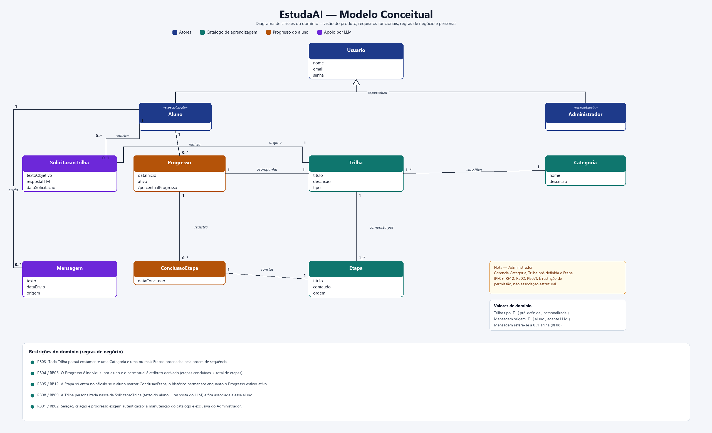
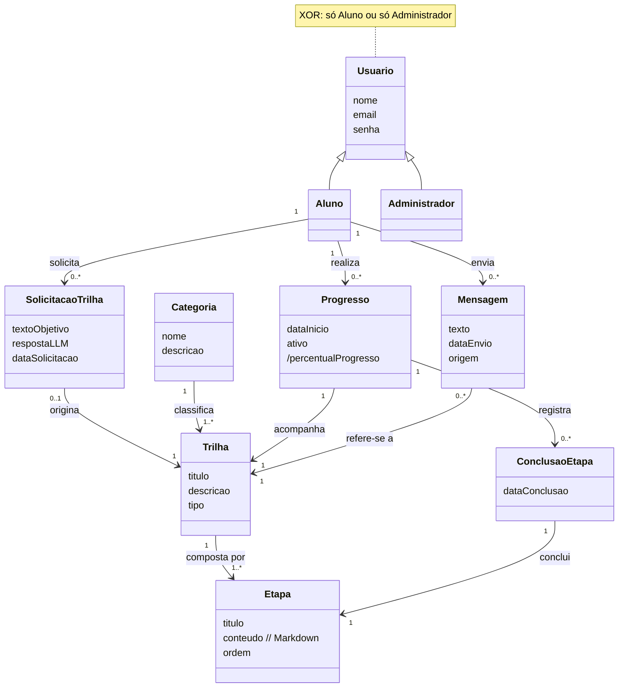

# Modelo Conceitual — EstudaAI

O **EstudaAI** é um sistema de recomendação de trilhas de aprendizagem. Este documento descreve o modelo conceitual do domínio, extraído da [visão do produto](visaodoproduto.md), dos [requisitos funcionais](EstudaAI_RF.md), das [regras de negócio](EstudaAI_RB.md) e das personas [Lucas Almeida](persona1.md) (aluno) e [Mariana Costa](persona2.md) (administradora).

O diagrama em PNG está em [`modelo-conceitual.png`](modelo-conceitual.png). Se o PNG divergir deste texto (XOR de perfil, `Mensagem` obrigatória à `Trilha`, Markdown em `conteudo`), **prevalece este documento**.

## 1. Objetivo do modelo

Representar as entidades do domínio, seus atributos essenciais e as associações com cardinalidade, **sem** decisões de implementação (chaves primárias, frameworks ou esquema físico). Operações administrativas de catálogo aparecem como restrição de permissão, não como associação persistida.

## 2. Entidades

| Entidade | Responsabilidade | Atributos | Origem |
|---|---|---|---|
| **Usuario** | Conta autenticável da plataforma | `nome`, `email` (único), `senha` (armazenada com hash) | RF01, RF02, RNF05 |
| **Aluno** | Especialização XOR de Usuario que estuda e acompanha trilhas | — | persona 1, RB01, RB04, RB14 |
| **Administrador** | Especialização XOR de Usuario autorizada a manter o catálogo e o interruptor do LLM | — | persona 2, RF09–RF13, RB02, RB14 |
| **Categoria** | Organização do catálogo por área de aprendizagem | `nome`, `descricao` | RF03, RF09, RB03 |
| **Trilha** | Percurso de aprendizagem pré-definido ou personalizado | `titulo`, `descricao`, `tipo` | RF03–RF05, RF10, RB03, RB07, RB08 |
| **Etapa** | Unidade ordenada de conteúdo dentro de uma trilha | `titulo`, `conteudo` (Markdown), `ordem` | RF05, RF11, RF12, RB03 |
| **Progresso** | Acompanhamento individual de um aluno em uma trilha | `dataInicio`, `ativo`, `/percentualProgresso` | RF06, RB04, RB06, RB12 |
| **ConclusaoEtapa** | Registro explícito de que o aluno concluiu uma etapa | `dataConclusao` | RF07, RB05, RB12 |
| **SolicitacaoTrilha** | Pedido em linguagem natural que origina uma trilha personalizada | `textoObjetivo`, `respostaLLM`, `dataSolicitacao` | RF04, RB08, RB09 |
| **Mensagem** | Turno da conversa com o agente LLM ligada à trilha em estudo | `texto`, `dataEnvio`, `origem` | RF08, RB10 |

`/percentualProgresso` é atributo **derivado**: etapas com `ConclusaoEtapa` ÷ total de etapas da trilha (RB06).

O atributo `Usuario.senha` no modelo é o conceito de credencial; o armazenamento concreto é hash, não texto aberto.

`Progresso.ativo` distingue acompanhamento vigente. Nesta versão não há operação de pausar, abandonar ou reiniciar.

Valores de domínio:

- `Trilha.tipo` ∈ { `pré-definida`, `personalizada` }
- `Mensagem.origem` ∈ { `aluno`, `agente LLM` }
- Categoria sentinela obrigatória para trilha personalizada: nome **Personalizada** (RB03)
- `respostaLLM` (em `SolicitacaoTrilha`) é JSON com `titulo`, `descricao` e etapas `{titulo, conteudo, ordem}`

## 3. Relacionamentos

| Origem | Associação | Destino | Cardinalidade | Leitura |
|---|---|---|---|---|
| Usuario | especializa | Aluno, Administrador | XOR: exatamente um subtipo | Todo usuário é **só** aluno **ou** **só** administrador (RB14) |
| Aluno | solicita | SolicitacaoTrilha | 1 : 0..* | O aluno descreve objetivos em linguagem natural |
| Aluno | realiza | Progresso | 1 : 0..* | Cada acompanhamento é individual (RB04) |
| Aluno | envia | Mensagem | 1 : 0..* | Conversa de apoio ao estudo (RF08) |
| SolicitacaoTrilha | origina | Trilha | 0..1 : 1 | Só a trilha personalizada nasce da solicitação; a pré-definida não possui solicitação |
| Categoria | classifica | Trilha | 1 : 1..* | Toda trilha possui uma categoria (RB03) |
| Trilha | composta por | Etapa | 1 : 1..* | Toda trilha tem uma ou mais etapas ordenadas (RB03, RF12) |
| Progresso | acompanha | Trilha | 1 : 1 | O aluno acompanha uma trilha por vez neste vínculo |
| Progresso | registra | ConclusaoEtapa | 1 : 0..* | Histórico de conclusões enquanto o progresso está ativo (RB12) |
| ConclusaoEtapa | conclui | Etapa | 1 : 1 | Conclusão explícita; sem marcação a etapa não conta (RB05) |
| Mensagem | refere-se a | Trilha | 0..* : 1 | Conversa exige trilha em andamento (RF08) |

O administrador **não** possui associação estrutural com Categoria, Trilha ou Etapa. RF09–RF12 e RB02 definem uma restrição de permissão: apenas o perfil administrador altera o catálogo.

## 4. Regras de domínio que o modelo precisa respeitar

1. **RB03** — Toda `Trilha` possui exatamente uma `Categoria` e uma ou mais `Etapa` ordenadas. Personalizadas usam a sentinela **Personalizada**.
2. **RB04 / RB06** — `Progresso` é individual por aluno; o percentual é derivado.
3. **RB05 / RB12** — `Etapa` só entra no percentual se existir `ConclusaoEtapa`; o histórico permanece enquanto `Progresso.ativo` for verdadeiro.
4. **RB08 / RB09** — Trilha `personalizada` é criada a partir de `SolicitacaoTrilha` (texto do aluno + `respostaLLM` JSON) e fica associada a esse aluno via `Progresso`.
5. **RB01 / RB02 / RB07 / RB14** — Uso de trilhas e progresso exige autenticação; listagem do catálogo pode ser anônima; cadastro de trilhas pré-definidas é exclusivo do administrador; perfis são XOR.
6. **RB10** — Mensagens do agente são apoio ao estudo, exigem trilha em andamento e não substituem a curadoria.
7. **RB11 / RB13** — Não se remove etapa com progresso vigente nem categoria que ainda classifique trilhas. `ConclusaoEtapa` já gravadas são preservadas. Recusa-se remoção que deixaria a trilha sem etapas.

## 5. Diagrama em Mermaid

Equivalente textual do PNG, para leitura no repositório:

## 6. Rastreabilidade

| Necessidade observada nos documentos | Como o modelo contempla |
|---|---|
| Cadastro e login com perfil (RF01, RF02, RB14) | `Usuario` e especializações XOR `Aluno` / `Administrador` |
| Catálogo por área e trilhas curadas (RF03, RF09, RF10, RB07) | `Categoria` classifica `Trilha` com `tipo = pré-definida` |
| Trilha gerada por LLM a partir de objetivo em linguagem natural (RF04, RB08, RB09) | `SolicitacaoTrilha` origina `Trilha` personalizada, depois acompanhada por `Progresso` do aluno |
| Visualizar etapas, conteúdos e sequência (RF05, RF12) | `Etapa.titulo`, `conteudo` e `ordem` na composição da trilha |
| Progresso percentual e conclusão explícita (RF06, RF07, RB05, RB06) | `Progresso` + `ConclusaoEtapa` + atributo derivado |
| Conversa de dúvidas e sugestões (RF08, RB10) | `Mensagem` associada ao aluno e obrigatoriamente à trilha em andamento |
| Administração restrita (RF09–RF12, RB02, RNF06) | Restrição de permissão sobre o catálogo, registrada na nota do administrador |
| Integridade ao remover etapa ou categoria (RB11, RB13) | `ConclusaoEtapa` e `Progresso` tornam visível o uso; remoção é recusada enquanto houver vínculo |
